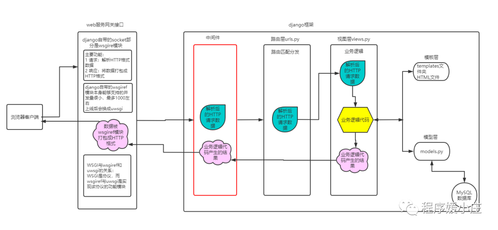
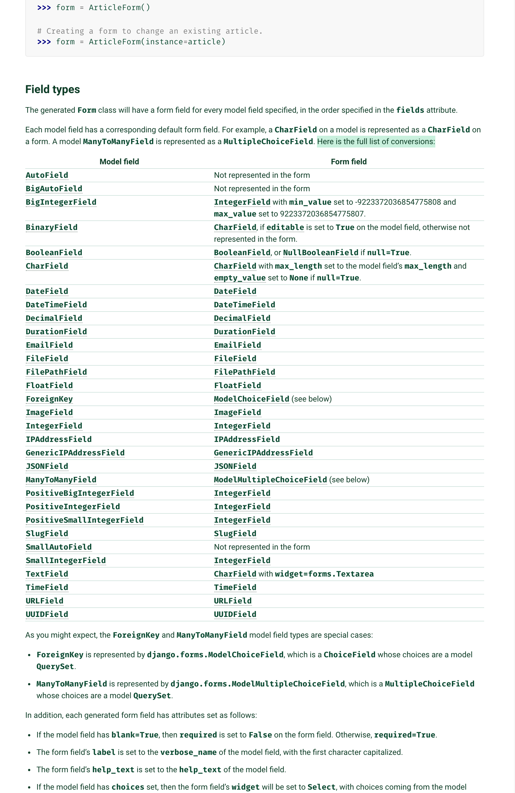

# Django<https://www.jianshu.com/p/3fc79a1e0edb>

## djnago 生产部署遇到问题

> 需要再部署之前，收集静态资源:python manage.py collectstatic
> 收集之后，遇到静态资源加载不到：
>
> - 将 DEBUG 条件下的路由放出来
> - 将收集的 static 资源，放到 nginx 服务，直接提供静态资源服务

## Definitions

### Django application

### Django static

> such as images, JavaScript or CSS ,in Django , we refer to those files as "static files"

## Django 命令

> python manage.py sqlmigrate user 0020
>
> python manage.py sqlmigrate appName 迁移文件序号

## Django 技术点



### Model

> Generally, each model maps to a single database table. Each model is a Python class that subclasses django.db.models.Model
>
> Each attribute of the model represents a database field.
>
> A model’s database table name is constructed by joining the model’s “app label” – the name you used in manage.py startapp – to the model’s class name, with an underscore between them.
>
> - 【默认表名：appName_modelClassName】
> - 修改表名：To override the database table name, use the `db_table` parameter in class Meta.`Use lowercase table names for MariaDB and MySQL`
> - 添加表注释信息：`db_table_comment`

```python
# common app
class Name(models.Model):
  name = models.TextField()
  class Meta:
    # https://docs.djangoproject.com/en/4.2/ref/models/options/#table-names
    db_table = 'wfhsite_name' # 自定义表名，默认应该是common_name
    db_table_comment = '这是一个demo表'
    # abstract：抽象基类
    # app_label：声明所属app
    # base_manager_name：默认是objects
    # default_manager_name
    # default_related_name

```

> 一个 model class 实例代表一条记录
>
> 每一个 model class 都有至少一个 manager，默认 manager 是 objects，通过 manager 可以获取 QuerySet 对象

- `django.db.models.Model`
- `Each model is a Python class that subclasses django.db.models.Model`
- `Each attribute of the model represents a database field`
- `Django gives you an automatically-generated database-access API`[Making queries](https://docs.djangoproject.com/en/4.0/topics/db/queries/)
- `APIs`
  - save()：保存数据到数据库，对应 INSERT 操作
  - create()：
  - QuerySet：代表一组对象的集合，可以拥有多个过滤器；对应 SELECT...WHERE...LIMIT 操作

```python
from django.db from models

class CustomModel(models.Model):
  pass
```

### Django ORM

> Django ORM 用到三个类：Manager、QuerySet、Model
>
> Manager 定义表级方法（表级操作）：影响一条或多条记录的方法，django.db.models.Manager
>
> QuerySet（记录级操作）： Manager 的一些方法会返回 QuerySet 实例，QuerySet 是一个可遍历结构，包含一组 Model 实例，每个实例就是一条记录
>
> Model：没有给 Model 实例都会有一个默认的 Manager 对象：objects

- `Model APIs`
  - `objects`：类`静态`属性
- `Manager APIs`[参考资料](https://www.cnblogs.com/jiakecong/p/14785889.html)
  - `Entry.objects.all()`对应 SELECT \* from Entry，返回对应表 Entry 的所有记录
  - `Entry.objects.filter(**kwargs)`等价与`Entry.objects.all().filter()`
  - `Entry.objects.exclude(**kwargs)`等价与`Entry.objects.all().exclude()`
  - `Entry.objects.get()`
- `QuerySet APIs：`[QuerySet APIs](https://docs.djangoproject.com/en/4.0/ref/models/querysets/#django.db.models.query.QuerySet)
  - `save()`：插入、更新、删除数据，这是`实例`方法
  - `delete()`
  - `update()`
  - `filter()`
  - `exclude()`
  - `get()`
  - `annotate()`
  - `alias()`
  - `order_by()`
  - `reverse()`
  - `distinct()`
  - `values()`
  - `values_list()`
  - `dates()`
  - `datetimes()`
  - `none()`
  - `all()`
  - `union()`
  - `intersection()`
  - `difference()`
  - `select_related()`
  - `extra()`
  - `create()`

#### Model Field<https://docs.djangoproject.com/en/4.0/ref/models/fields/>

> Field is an abstract class that represents a database table column.Django uses fields to create the database table (db_type()), to map Python types to database (get_prep_value()) and vice-versa (from_db_value())
>
> Field including the field options and field types Django offers

```python
from django.db from models

class CustomModel(models.Model):
  pass
```

> 一个 Model 类代表一张表(Table)；一个 Model 类实例代表一个记录(Record)，既一条数据

##### Django 模型之内置类 class Meta<https://docs.djangoproject.com/en/4.0/ref/models/options/>

> 使用内部类提供一些 metadata，内置类完全是可选的

- `abstract`定义外部类是否是抽象类
- `app_label`声明当前数据模型属于哪一个应用，INSTALLED_APPS 指定的应用
- `db_table`指定对应 Model 生成的表名。默认是 appname_modelname，例如 demos 中的 Student 对应的表名：demos_student
- `ordering`排序，是一个列表
- `unique_together`在数据进行写表操作的时候，我们往往会遇到两个字段组合起来需要唯一的情况
- `verbose_name`A human-readable name for the object singular（单数）
- `verbose_name_plural`The plural(复数形式可读性名字) name for the object

##### django field options

> 以下 options 适应所有 Field，都是可选项

- `Field.null：`如果为 True，数据库字段将空值存储为 NULL，默认是 false。
- `Field.blank：`如果为 True，数据库字段允许为空，默认是 false
- `Field.choices：`A sequence consisting itself of iterables of exactly two items (e.g. [(A, B), (A, B) ...]) to use as choices for this field
- `Field.db_column：`The name of the database column to use for this field. If this isn’t given, Django will use the field’s name.
- `Field.db_index：`If True, a database index will be created for this field
- `Field.db_tablespace：`The name of the database tablespace to use for this field’s index, if this field is indexed
- `Field.default：`默认值
- `Field.editable：`If False, the field will not be displayed in the admin or any other ModelForm
- `Field.error_message：`
- `Field.help_text：`Extra “help” text to be displayed with the form widget
- `Field.primary_key：`
- `Field.unique：`If True, this field must be unique throughout the table
- `Field.unique_for_date：`
- `Field.unique_for_month：`
- `Field.unique_for_year：`
- `Field.verbose_name：`
- `Field.validators`

##### django field types

> Django ModelField To FormField, ModelField 映射数据库；FormField 映射 HTML 表单组件
> 

- `class AutoField(**options)：`An IntegerField that automatically increments according to available IDs
- `class BigAutoField(**options)：`
- `class BigIntegerField(**options)：`
- `class BinaryField(max_length=None, **options)：`
- `class BooleanField(**options)：`Default widget: CheckboxInput
- `class CharField(max_length=None, **options)：`Default widget: TextInput
- `class DateField(auto_now=False, auto_now_add=False, **options)：`Default widget: DateInput
- `class DateTimeField(auto_now=False, auto_now_add=False, **options)：`Default widget: DateTimeInput
- `class DecimalField(max_digits=None, decimal_places=None, **options)：`Default widget: NumberInput when Field.localize is False, else TextInput
- `class DurationField(**options)：`Default widget: TextInput
- `class EmailField(max_length=254, **options)：`Default widget: EmailInput
- `class FileField(upload_to=None, max_length=100, **options)：`Default widget: ClearableFileInput
- `class FilePathField(path='', match=None, recursive=False, allow_files=True, allow_folders=False, max_length=100, **options)：`Default widget: Select
- `class FloatField(**options)：`Default widget: NumberInput when Field.localize is False, else TextInput
- `class ImageField(upload_to=None, height_field=None, width_field=None, max_length=100, **options)：`Default widget: ClearableFileInput
- `class IntegerField(**options)：`Default widget: NumberInput when Field.localize is False, else TextInput
- `class JSONField(encoder=None, decoder=None, **options)：`Default widget: Textarea
- `class PositiveBigIntegerField(**options)：`
- `class PositiveIntegerField(**options)：`
- `class PositiveSmallIntegerField(**options)：`
- `class SlugField(max_length=50, **options)：`Default widget: TextInput
- `class SmallAutoField(**options)：`
- `class SmallIntegerField(**options)：`
- `class TextField(**options)：`
- `class TimeField(auto_now=False, auto_now_add=False, **options)：`Default widget: TimeInput
- `class URLField(max_length=200, **options)：`
- `class UUIDField(**options)：`Default widget: TextInput
- `class ForeignKey(to, on_delete, **options)：`
- `class ManyToManyField(to, **options)：`
- `class OneToOneField(to, on_delete, parent_link=False, **options)：`

##### Apis

- `instance.save()`：保存新数据
- `class.objects.get()`：检索一条数据
- `class.objects.all()`：检索所有数据，返回一个 QuerySet
- `class.objects.filter()`
- `class.objects.exclude()`

```python
  # Limiting QuerySets，使用Python的array-slicing语法限制QuerySet，等价SQL中的LIMIT和OFFSET分句
  Entry.objects.all()[2:5]
  # Field lookups，等价WHERE分句
  Entry.objects.filter(pub_date__lte='2006-01-01')
  # __lte(<=), __exact(=), __iexact(=), __contains(LIKE '% %'),
```

##### QuerySet<https://docs.djangoproject.com/en/4.0/ref/models/querysets/>

> 在内部，可以构造，过滤，切片以及传递 QuerySet，且不会触发数据库查询操作。直到 QuerySet 被计算（evaluated）
>
> 以下是触发 QuerySet 计算的场景：

- `Iteration`：当 QuerySet 被迭代时
- `Sliceing`：切片时
- `Pickling/Caching`
- `repr()`
- `len()`
- `list()`
- `bool()`
  > QuerySet Apis, class QuerySet(model=None, query=None, using=None, hints=None)
  - `ordered：`属性
  - `db：`属性
  - `filter(*args, **kwargs)：`返回新 QuerySet
  - `exclude(*agrs, **kwargs)：`返回新 QuerySet
  - `annotate(*agrs, **kwargs)：`
  - `alias(*agrs, **kwargs)：`
  - `order_by(*fields)：`
  - `reverse()：`
  - `distinct()：`返回一个新 QuerySet
  - `values()：`返回新 QuerySet
  - `values_list()`
  - `dates(field, kind, order='ASC')`
  - `none()`
  - `all()`
  - `union()`
  - `difference()`
  - `select_related()`

##### Field lookups

> 未提供 lookup，默认是 exact(=)。用法：字段名\_\_lookup 形式

#### Django 数据对应关系

> 关系型数据库存在一对多、一对一、多对多的关系
>
> 一对一：models.OneToOneField('class_name', on_delete=models.CASCADE)
>
> 一对多：models.ForeignKey('class_name', on_delete=models.CASCADE)
>
> 多对多：models.ManyToManyField('class_name')

- `ForeignKey(otherModel, on_delete, **options)`
  > otherModel：关联的表格（主表），默认外键存储的是主表的主键，但可以通过 to_field 修改
  >
  > on_delete：
  > CASCADE，当主表的字段被删除时，和它有关的子表字段也会被删除
  > PROJECT，阻止删除并抛出一个 ProjectedError
  > RESTRICT，类似 PROJECT
  > SET_NULL，将 ForeignKey 设置为 null，如果允许设置 null 值
  > SET_DEFAULT，
  > SET()，
  > DO_NOTHING，
  >
  > db_column：可以指定字段名
  >
  > options：to_field，改变关联的字段

```python
# 实体：Class(班级)、Teacher(老师)、Student(学生)、StudentDetail(学生信息)
# Class和Teacher是 多对多 关系
# Class和Student是 一对多 关系
# Student和StudentDetail是 一对一 关系
class Student(models.Model):
  id = models.AutoField(primary_key=True)
  sname = models.CharField(max_length=20)

  # 一对多外键
  cid = models.ForeignKey('Class', on_delete=models.CASCADE)
  # 一对一外键
  cid = models.OneToOneField('StudentDetail', on_delete=models.CASCADE)

class StudentDetail(models.Model):
  id = models.AutoField(primary_key=True)
  height = models.IntegerField()
  #...

class Class(models.Model):
  id = models.AutoField(primary_key=True)
  cname = models.CharField(max_length=20)

class Teacher(models.Model):
  id = models.AutoField(primary_key=True)
  cname = models.CharField(max_length=20)

  # 多对多
  cid = models.ManyToManyField('Class')

```

### Views

> 作用是组合模板(template)和数据(model)

- `函数视图(Function View)`每个视图函数负责返回 HttpResponse 对象。视图应该返回 HttpResponse 实例
- `类视图(Class View)`函数视图也提供了类函数，模拟函数视图
  > Django 附带了一些内置的通用你视图例如：TemplateView、TalkListView、RegisteredUserListView 等等

```python
# views.py
from django.http import HttpResponse
from django.shortcuts import render
from django.views import View

# render(request, template, context)

# 视图函数
def myview(request):
    if request.method == 'GET':
      return HttpResponse("return this string")

# 类视图
class MyView(View):
  def get(self, request):
    return HttpResponse('result')

```

- `基于类的视图和基于函数的视图:`https://docs.djangoproject.com/zh-hans/4.0/topics/class-based-views/intro/

  - `视图函数：`Django 传递 HttpRequest 给视图函数，视图函数返回一个 HttpResponse
  - `基于函数的通用视图：`
  - `基于类的通用视图：`

- `TemplateResponse`

### Template

> filter 一般接受 1-2 个参数；tags 可以接受多个参数
>
> filter 一般返回一个 template variable
>
> tags（simple_tag）可以返回 template varible，
> tags（inclusion_tag）可以返回 template

#### [how to manage static files](https://docs.djangoproject.com/en/4.1/howto/static-files/)

> Django 中将 images、css、js 视为 static files
>
> static 针对项目静态资源；
>
> media 针对用户上传资源

- `STATIC_ROOT：`默认值 None，指定静态资源归集目录，即服务器的 webroot 目录
- `STATIC_URL：`默认值 None，指定静态文件访问 path 前缀，配合 static 模板标签使用
- `STATICFILES_DIRS：`指定静态文件查询器查询目录，即源码中静态资源所在目录
- `STATICFILES_STORAGE：`Default: 'StaticFilesStorage'，配置静态文件存储引擎
- `STATICFILES_FINDERS：`DEfault: ['FileSystemFinder', 'AppDirectoriesFinder']，静态文件搜索引擎（查询器）
- `MEDIA_ROOT：`指定用户上传资源目录
- `MEDIA_URL：`指定用户上传资源引用是的 path 前缀

#### StaticFiles: django.contrib.staticfiles

##### collectstatic：收集静态文件

> django 命令：django-admin collectstatic
>
> Collects the static files into STATIC_ROOT

##### findstatic：搜索静态文件

> django 命令：django-admin findstatic
>
> Searches for one or more relative paths with the enabled finders

#### Storages

> 存储引擎

##### StaticFileStorage

> 静态文件存储引擎，

##### ManifestStaticFilesStorage

#### Template override

> You can either put template overrides in your `project’s templates directory` or in an `application’s templates directory`.

> `the default Django template loader` will try to load the template from the `project-level directory first`. In other words, `DIRS` is searched before `APP_DIRS.`

> [Django override templates](https://docs.djangoproject.com/en/4.1/howto/overriding-templates/)

> [Overriding built-in widget templates](https://docs.djangoproject.com/en/4.1/ref/forms/renderers/#overriding-built-in-widget-templates)

#### template tag override

>  template tag

#### filter 本质就是 python 函数

> filter 就是只能接收 1 或 2 个参数的 python 函数。它只适用于修改数据的呈现方式
>
> 因为模板语言不提供异常处理机制，所以任何从模板过滤器中抛出的异常都将被视为服务器异常

#### django template tags and filters<https://docs.djangoproject.com/en/3.1/ref/templates/builtins/>

> When a Django app is added to INSTALLED_APPS, any tags it defines in the conventional location described below are automatically made available to load within templates
>
> 默认路径是：Your custom tags and filters will live in a module inside the templatetags directory. The name of the module file is the name you’ll use to load the tags later
>
> 自定义 tag 和 filter 会定义在 templatetags 模块中，对应的模块名就是要用到的标签。例如

```plain
polls/
  __init__.py
  models.py
  templatetags/
    __init__.py
    poll_extras.py // 过滤器
  views.py

  <!-- 加载 -->
  
  <!-- polls app必须添加到INSTALLED_APPS -->
```

##### build-in tag

> tag 的用法，tag 可以接收参数

```template
    
        {{ 内容 }}
    
    
        {{ body }}
    
```

- `extends：`
- `block：`定义可以被 overridden 的 block
- `comment：`
- `for：`
- `for ... empty：`
- `if：`
- `filter：`
- `autoescape：`
- `csrf_token：`
- `cycle：`
- `debug：`
- `firstof：`
- `Boolean operators：`
  - `and`
  - `or`
  - `and not`
  - `==`
  - `!=`
  - `<`
  - `<=`
  - `>`
  - `>=`
  - `in`
  - `not in`
  - `is not`
- `Filters：`
  - `|`
- `Complex expressions：`
  - `or`
- `ifchanged：`
- `include：`
- `load：`
- `lorem：`
- `now：`
- `regroup：`
- `resetcycle：`
- `spaceless：`
- `templatetag：`
- `url：`
- `verbatim：`
- `widthratio：`
- `with：`

##### built-in filter

> filter 用法

```template
    {{ value|add:"2"}}
```

- `add：`
- `addslashes：`
- `capfirst：`
- `center：`
- `cut：`
- `date：`
- `default：`
- `default_if_none：`
- `dictsort：`
- `dictsortreversed：`
- `divisibleby：`
- `escape：`
- `escapejs：`
- `filesizeformat：`
- `first：`
- `floatformat：`
- `force_escape：`
- `get_digit：`
- `iriencode：`
- `join：`
- `join_script：`
- `last：`
- `length：`
- `length_is：`
- `linebreaks：`
- `linebreaksbr：`
- `linenumbers：`
- `ljust：`
- `lower：`
- `make_list：`
- `phone2numeric：`
- `pluralize：`
- `pprint：`
- `random：`
- `rjust：`
- `safe：`
- `safeeq：`
- `slice：`
- `slugify：`
- `stringformat：`
- `striptags：`
- `time：`
- `timesince：`
- `timeuntil：`
- `title：`
- `truncatechars：`

##### 三方库 tags 和 filters

###### django.contrib.humanize

- `static：`To link to static files that are saved in STATIC_ROOT Django ships with a static template tag. If the django.contrib.staticfiles app is installed, the tag will serve files using url() method of the storage specified by STATICFILES_STORAGE
- `get_static_prefix`
- `get_media_prefix`

## Django Demo

```js
/*
Django 路由部分：
  path(route, view, **kwargs, name)
   route：路由规则
   view：视图函数，并传入HttpRequest对象
   kwargs：额外的传递给视图函数的参数
   name：为你的 URL 取名能使你在 Django 的任意地方唯一地引用它，尤其是在模板中。这个有用的特性允许你只改一个文件就能全局地修改某个 URL 模式。

Django 配置文件：
  DATABASES配置域
  INSTALLED_APPS配置域，包括了Django自带的应用
    django.contrib.admin------管理员站点
    django.contrib.auth------认证授权系统
    django.contrib.contenttypes------内容类型框架
    django.contrib.sessions------会话框架
    django.contrib.message------消息框架
    django.contrib.staticfiles------管理静态文件的框架
*/
```

### HttpRequest and HttpResponse

> Django uses request and response objects to pass state through the system.
> When a page is requested, Django creates an HttpRequest object that contains metadata about the request. Then Django loads the appropriate view, passing the HttpRequest as the first argument to the view function. Each view is responsible for returning an HttpResponse object

```js
/*
// https://docs.djangoproject.com/en/4.0/ref/request-response/#django.http.HttpRequest
  HttpRequest:
    schema：http或HTTPS
    body：raw 请求体
    path：完整请求路径
    path_info：
    method：请求方法
    encoding：
    content_type：
    content_params：
    GET：A dictionary-like object containing all given HTTP GET parameters
    POST：A dictionary-like object containing all given HTTP POST parameters, providing that the request contains form data
    COOKIES：
    FILES：
    META：A dictionary containing all available HTTP headers
    headers：
    resolver_match：

    current_app：
    urlconf：
    exception_reporter_filter：
    exception_reporter_class

    session：
    site：
    user：

    get_host()
    get_port()
    get_full_path()
    get_full_path_info()
    build_absolute_uri(location=None)
    get_signed_cookie(key, default=RAISE_ERROR, salt='', max_age=None)
    is_secure()
    accepts(mime_type)
    read(size=None)
    readline()
    readlines()
    __iter__()

    *******************************
    HttpResponse，还有很多子类，处理不同的场景
      content:
      headers:
      charset:
      status_code:
      reason_phrase:
      streaming:
      closed:
      __init__(content=b'', content_type=None, status=200, reason=None, charset=None, headers=None):
      __setitem__(header, value):
      __delitem__(header):
      __getitem__(header):
      get(header, alternate=None):
      has_header(header):
      items():
      setdefault(header, value):
      set_cookie(key, value='', max_age=None, expires=None, path='/', domain=None, secure=False, httponly=False, samesite=None):
      set_signed_cookie(key, value, salt='', max_age=None, expires=None, path='/', domain=None, secure=False, httponly=False, samesite=None):
      delete_cookie(key, path='/', domain=None, samesite=None):
      close():
      write(content): This method makes an HttpResponse instance a file-like object
      flush(): 同write
      tell(): 同write
      getvalue(): This method makes an HttpResponse instance a stream-like object
      readable(): This method makes an HttpResponse instance a stream-like object
      seekable(): 同readable
      writable():
      writelines(lines):

      **************************************************************************
      https://docs.djangoproject.com/zh-hans/4.0/ref/template-response/#django.template.response.SimpleTemplateResponse
      由于HttpResponse对象在初始化结束后文档内容就已经固定了，很难再进行修改，所以在使用中可能会遇到一些不便，例如修改HttpResponse对象所使用的模板，或者在现有模板中添加新数据，这些都很难实现。为了解决这些问题，Django提供了一个全新的对象：TemplateResponse。与HttpResponse不同的是，TemplateResponse会保留模板和上下文对象，直到需要输出时才将模板编译成HTML文档。

      一个 TemplateResponse 对象可以被用于任何可以使用普通 django.http.HttpResponse 的地方。它也可以作为调用 render() 的替代。
      **************************************************************************
      from django.template.response import TemplateResponse

      SimpleTemplateResponse
        template_name：要渲染的模板的名称。名称或名称列表
        context_data：渲染上下文，必须是dict
        rendered_content：响应内容的当前渲染值，使用当前模板和上下文数据
        is_rendered：表示响应内容是否已呈现的布尔值

        render()：
      TemplateResponse

*/
```

### django.urls 模块

> 将路由和 View 匹配起来

- `path(url, views)：`将路由和 view 匹配起来

## Widgets

> A widget is Django’s representation of an HTML input element. The widget handles the rendering of the HTML, and the extraction of data from a GET/POST dictionary that corresponds to the widget.
>
> Whenever you specify a field on a form, Django will use a default widget that is appropriate to the type of data that is to be displayed.
>
> built-in Field classes<https://docs.djangoproject.com/en/4.0/ref/forms/fields/#built-in-fields>
>
> if you want to use a different widget for a field, you can use the widget argument on the field definition. For example:

```python
from django import forms

class CommentForm(forms.Form):
  name = forms.CharField()
  url = forms.URLField()
  comment = forms.CharField(widget=forms.Textarea)
```

## Django 其它技术点

### Django 日志

## Django Settings

```python
# URL
APPEND_SLASH
PREPEND_WWW
ROOT_URLCONF = []
# TEMPLATES
TEMPLATES = []
# MODELS
INSTALLED_APPS = []
FIXTURE_DIRS = []
ABSOLUTE_URL_OVERRIDES = []
# LOGGING
LOGGING
LOGGIN_CONFIG
# DATABASE
DATABSES = []
DATABASE_ROUTERS = []
DEFAULT_INDEX_TABLESPACE = []
DEFAULT_TABLESPACE = []
# staticfiles
STATICFILES_DIRS = []
STATICFILES_STORAGE = []
STATICFILES_FINDERS = []
STATIC_ROOT = 'WEBROOT'
STATIC_URL = 'PREFIX_URL'
# FILE UPLOADS
DEFAULT_FILE_STORAGE
FILE_UPLOAD_HANDLERS
FILE_UPLOAD_MAX_MEMORY_SIZE
FILE_UPLOAD_PERMISSIONS
FILE_UPLOAD_TEMP_DIR
MEDIA_ROOT = 'USER WEBROOT'
MEDIA_URL = 'USER_PREFIX_URL'
```
