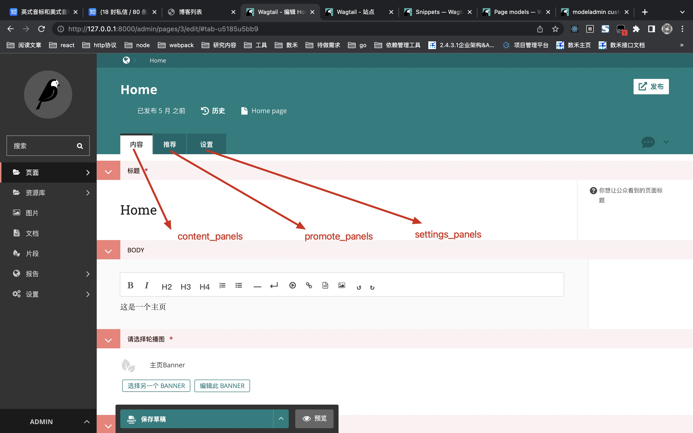

# wagtail

## 术语

### page<https://docs.wagtail.org/en/stable/reference/pages/model_reference.html#wagtail.models.Page>

> Each page type(Page Model) (a.k.a. content type) in Wagtail is represented by a Django model. All page models must inherit from the wagtail.models.Page class.

- `Database fields：`对应数据库字段
- `Search：`建立索引，待进一步理解
- `Editor Panels：`后台管理配置，如下图
  

  - `content_panels` - For content, such as main body text
  - `promote_panels` - For metadata, such as tags, thumbnail image and SEO title
  - `settings_panels` - For settings, such as publish date
#### Database fields
- `title:`Human-readable title of the page
- `draft_title:`Human-readable title of the page, incorporating any changes that have been made in a draft edit
- `slug:`This is used for constructing the page’s URL
- `content_type:`A foreign key to the ContentType object that represents the specific model of this page
- `live:`
- `has_unpublished_changes:`
- `owner:`
- `first_published_at:`
- `last_published_at:`
- `seo_title:`
- `search_description:`
- `show_in_menus:`
- `locked:`
- `locked_by:`
- `locked_at:`
- `alias_of:`
- `locale:`
- `translation_key:`

#### 属性
- `specific`
- `specific_deferred`
- `specific_class`
- `cached_content_type`
- `page_type_display_name`
- `full_url`
- `context_object_name = None`
- `preview_modes`
- `localized`
- `localized_draft`
- `search_fields`
- `subpage_types`
- `parent_page_types`
- ``
- ``
- ``
- ``
#### 成员函数

- `get_specific(deferred=False, copy_attrs=None, copy_attrs_exclude=None)`Return this object in its most specific subclassed form
- `get_url(request=None, current_site=None)`
- `get_full_url(request=None)`
- `relative_url(current_site, request=None)`
- `get_site()`
- `get_url_parts(request=None)`
- `route(request, path_components)`
- `serve(request, *args, **kwargs)`
- `get_context(request, *args, **kwargs)`
- `get_template(request, *args, **kwargs)`
- `get_admin_display_title()`
- `serve_preview(request, mode_name)`
- `get_parent(update=False)`
- `get_ancestors(inclusive=False)`
- `get_descendants(inclusive=False)`
- `get_siblings(inclusive=True)`
- `get_translations(inclusive=False)`
- `get_translation(locale)`
- `get_translation_or_none(locale)`
- `has_translation(locale)`
- `copy_for_translation(locale, copy_parents=False, alias=False, exclude_fields=None)`
- `classmethod can_exist_under(parent)`
- `classmethod can_create_at(parent)`
- `can_move_to(parent)`
- `get_route_paths()`
- ``
- ``
- ``
- ``
## 创建应用

> wagtail start appName [path]

## snippet<https://docs.wagtail.io/en/stable/topics/snippets.html>

> snippet 的菜单名成默认是 Snippets（一级入口就只能是 Snippets），不能修改
>
> Snippets 页面会展示不同的 Snippet（二级入口，可以自定义名字）

- `snippets包：`snippets 是一些 Django Models，非 Wagtail Page

```python
from wagtail.snippets.models import register_snippet
```

- `通过Templates Tags使用定义的Snippets`
  > 更多参考 Django custom template tags 文档<https://docs.djangoproject.com/en/4.0/howto/custom-template-tags/>

```python

```

## ModelAdminGroup<https://docs.wagtail.io/en/v2.15.1/reference/contrib/modeladmin/menu_item.html?highlight=ModelAdminGroup#id2>

> These stub classes allow us to put various models into the custom "Wagtail Bakery" menu item rather than under the default Snippets section
>
> 通过管理菜单，可以把 Snippet 做成一级入口

## 资料

[wagtail 图标](https://thegrouchy.dev/general/2015/12/06/wagtail-streamfield-icons.html)
[更多图标](https://fontawesome.com/v5.15/icons)

## MySql

## ER 图转换关系

- `1:1`
  > 1:1 关系时，可以把任意建个实体的主键作为其中一个实体的外键，加入关系模式
- `1:n`
  > 1:n 关系时，把 1 方的主键加入到 n 中
- `n:m`
  > 需要新抽出一个关系，并将 n 和 m 的主键存储在新关系中

## primary key（主键）

## ForeignKey（外键）

> 外键是用来解决 Many-to-one 的问题，用于关联查询

```python
    # ForeignKey(othermodel, on_delete, **options)
    # othermodel：关联的表（主表），在默认情况下，外键存储的是主表的主键（primary key）
    # on_delete='CASCADE'当主表的字段被删除时，和他有关的子表子弹也会被删除
    #           'PROTECT'：阻止删除，返回错误提示; 'SET_NULL'：用null代替;
    #           'SET_DEFAULT'：用默认值代替; 'SET()'：自定义
```

## parentalkey

> ParentalManyToManyField(Django--ManyToManyField)：add categories to the BlogPage model, as a many-to-many field
>
> ParentalKey：one-to-many relations

## InlinePanel<https://docs.wagtail.io/en/v2.15.1/reference/pages/panels.html#inline-panels>

## ModelAdmin<https://docs.wagtail.io/en/v2.15.1/reference/contrib/modeladmin/menu_item.html?highlight=ModelAdminGroup#id2>

- `安装应用`

```python
INSTALLED_APPS = [
  'wagtail.contrib.modeladmin'
]
```

- `使用`

## Panel Types

> Django’s field types are automatically recognised and provided with an appropriate widget for input

### Django widgets<https://docs.djangoproject.com/en/4.0/ref/forms/widgets/#built-in-widgets>

> from django import forms
>
> forms.TextInput

- `Built-in widgets：`
  - `TextInput`
  - `NumberInput`
  - `EmailInput`
  - `URLInput`
  - `PasswordInput`
  - `HiddenInput`
  - `DateInput`
  - `DateTimeInput`
  - `TimeInput`
  - `Textarea`
  - `CheckboxInput`
  - `Select`
  - `NullBooleanSelect`
  - `SelectMultiple`
  - `RadioSelect`
  - `CheckboxSelectMultiple`
  - `FileInput`
  - `ClearableFileInput`
  - `MultipleHiddenInput`
  - `SplitDateTimeWidget`
  - `SplitHiddenDateTimeWidget`
  - `SelectDateWidget`

### wagtail.admin.edit_handlers

- `FieldPanel(field_name,classname=None,widget=None,heading='',disable_comments=False)`
  > This is the panel used for basic Django field types
- `StreamFieldPanel(field_name, classname=None, widget=None)`
  > This is the panel used for Wagtail’s StreamField type
- `MultiFieldPanel(children, heading="", classname=None)`
  > This panel condenses several FieldPanel s or choosers, from a list or tuple, under a single heading string
- `InlinePanel(relation_name, panels=None, classname='', heading='', label='', help_text='', min_num=None, max_num=None)`
  > This panel allows for the creation of a “cluster” of related objects over a join to a separate model, such as a list of related links or slides to an image carousel.
- `FieldRowPanel(children, classname=None)`
- `HelpPanel(content='', template='wagtailadmin/edit_handlers/help_panel.html', heading='', classname='')`
- `PageChooserPanel(field_name, page_type=None, can_choose_root=False)`

### wagtail.images.edit_handlers

- `ImageChooserPanel(field_name)`

### wagtail.contrib.forms.edit_handlers

- `FormSubmissionsPanel`

### wagtail.documents.edit_handlers

- `DocumentChooserPanel(field_name)`

### wagtail.snippets.edit_handlers

- `SnippetChooserPanel(field_name, snippet_type=None)`
